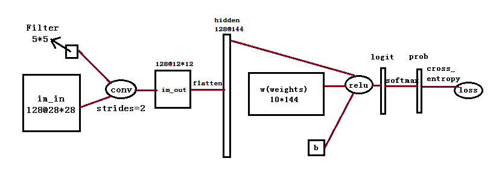

## A C implemention for convolutional network

This is a project for implementing a convolutional network by C, the convolutional network is
constructed as following:

 

The key kernel of convolutional network is the forward and back propagation of convolutional layer. 
We first give the formula of these two processes.

Let W be the input size, F be the filter size, S be the strider, and P be the output size, 
and we assume no padding here. Then W, F, S, P satisfy:

### Forward propagation
The forward propagation is the convolution of the input and the filter as following:

### Back propagation
The back propagation is the transfer of gradient by chain of rule, we have:

### Loss function
The loss function L is the softmax\_cross\_entropy of logits, we also give the formula of its forward and back propagation.

#### softmax_forward:

#### softmax_backward:

The softmax_backward depends labels, we have

if j doesn't equal to lb,

if j equals to lb,

#### cross\_entrop\_forward:

